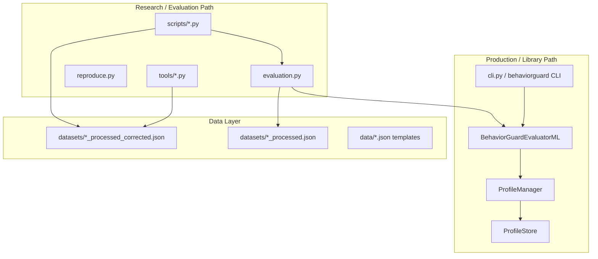
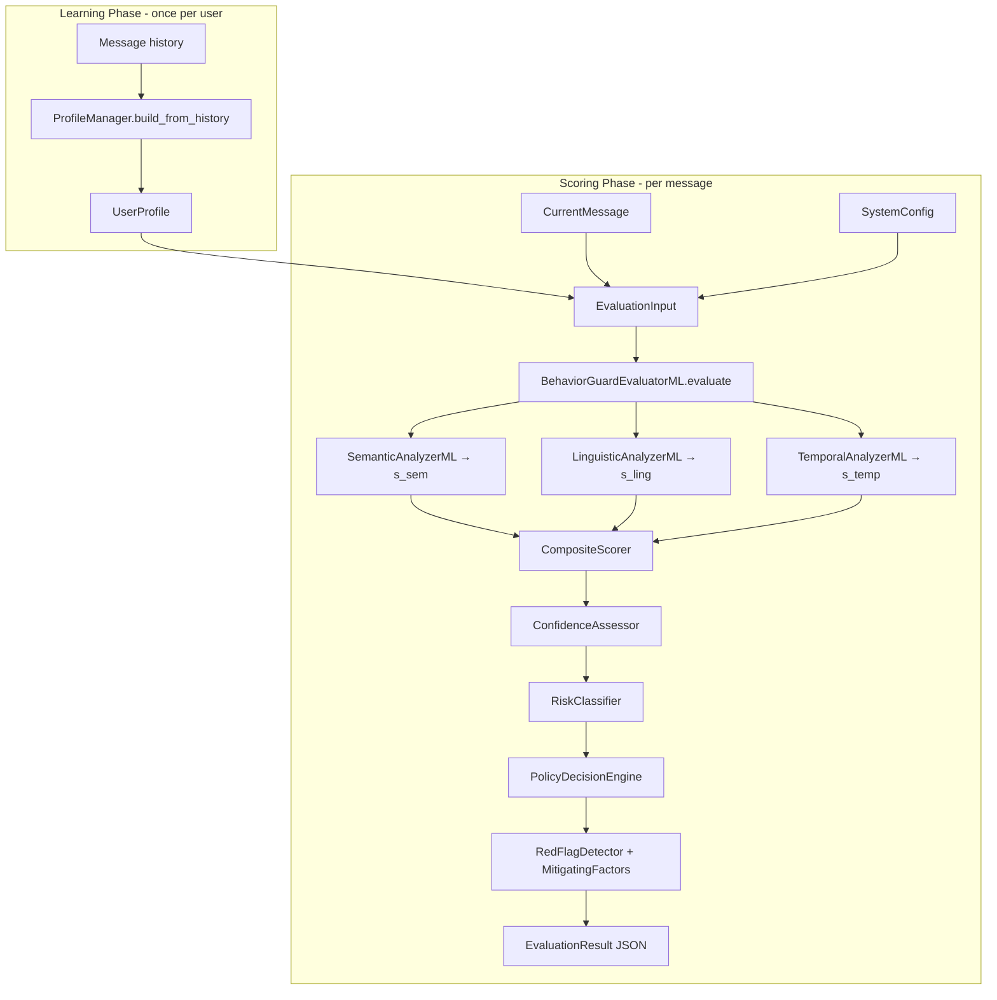
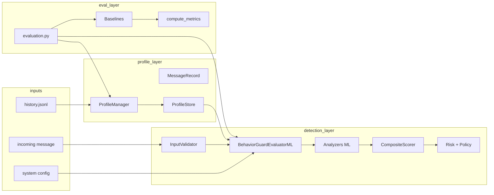

# BehaviorGuard Codebase Architecture Guide

BehaviorGuard is a **behavioral anomaly detector** for conversational AI: it learns per-user baselines from message history and scores new messages on semantic, linguistic, and temporal dimensions, then classifies risk and recommends policy actions.

---

## 1. What It Does (One Sentence)

**Given a user profile + a new message, BehaviorGuard outputs an anomaly score in [0, 1], a risk level, and a recommended action** — comparing the message against that user's learned behavioral baseline rather than generic content filters.

---

## 2. Glossary of Terms

| Term | Meaning |
|------|---------|
| **ATO** | Account takeover — attacker impersonates or hijacks a user account |
| **Behavioral baseline / profile** | Aggregated stats learned from a user's normal messages (no raw text stored) |
| **s_sem / semantic score** | How far the message's meaning (embedding) deviates from the user's topic/style centroid |
| **s_ling / linguistic score** | How far token count, diversity, formality, politeness deviate from the user's norms |
| **s_temp / temporal score** | How unusual the message timing is (hour, gaps, session length, frequency) |
| **Composite score / anomaly_score** | Weighted blend of s_sem, s_ling, s_temp, possibly overridden by rules |
| **λ (lambda)** | EMA decay in `ProfileManager` — how fast the profile forgets old behavior (default **0.95** in `ProfileManager`, **0.50** as `CANONICAL_LAMBDA` in `evaluation.py`) |
| **τ (tau)** | Classification threshold — `predicted_anomaly = anomaly_score > τ` (canonical τ = **0.60** in `evaluation.py`) |
| **Cold start** | User with < 20 interactions — conservative thresholds, low confidence |
| **Mahalanobis distance** | Statistical distance in feature space using mean + covariance (used for semantic and linguistic ML modes) |
| **Cosine distance** | Embedding-space distance from profile centroid (default semantic mode) |
| **Override 1–4** | Hard rules that can force HIGH_RISK regardless of weighted score (see §7) |
| **Override 4 / template override** | Embedding similarity to known jailbreak/ATO templates (θ ≈ 0.82) |
| **Confounded vs corrected datasets** | Original `*_processed.json` may leak labels via metadata; `*_processed_corrected.json` fixes injection |
| **Benign surface / gardening** | Anomaly text that looks innocent (e.g. hobby chat) but is injected for ATO testing |
| **F1-max threshold** | Pick τ that maximizes F1 on a tune set (used for fair baseline comparison) |
| **Detection mechanism** | Which path fired: `composite_score`, `override_1`, `override_4_template_match`, etc. |
| **Policy action** | Operational recommendation: allow, caution, block+OOB verify, escalate to human |
| **Baseline** | Comparison method in research (rule-based, Isolation Forest, Autoencoder, content-safety) — not the user profile |

---

## 3. Repository Layout — Where Things Live



| Area | Path | Role |
|------|------|------|
| **Core library** | `src/behaviorguard/` | All detection logic — this is what you import |
| **Tests** | `tests/` | 84+ pytest tests |
| **Main eval harness** | `evaluation.py`, `evaluate.py`, `reproduce.py` | Paper-scale experiments |
| **Diagnostic scripts** | `scripts/` | s_ling audits, fair tuning, wiring verification |
| **Dataset tools** | `tools/` | Anomaly templates + corrected dataset rebuild |
| **Datasets** | `datasets/` (gitignored) | PersonaChat, Blended Skill Talk, Anthropic HH |
| **Results** | `results/` (gitignored) | JSON/CSV outputs from runs |
| **Profiles** | `profiles/` (gitignored) | Saved user profile JSON |
| **Docs** | `README.md`, `REPRODUCIBILITY.md`, `INTEGRATION.md`, this file | Install, paper repro, diagnostic integration |

---

## 4. Core Runtime Pipeline (How Detection Works)

This is the path used by the CLI, `example_ml.py`, and production scoring.



### Step-by-step (10 stages inside `evaluator_ml.py`)

The orchestrator wires analyzers → composite scorer → classifiers → explainers:

```71:203:src/behaviorguard/evaluator_ml.py
    def evaluate(self, evaluation_input: EvaluationInput) -> EvaluationResult:
        # ...
        # Step 1: ML-based Component Analysis
        semantic_result = self.semantic_analyzer.analyze(...)
        linguistic_result = self.linguistic_analyzer.analyze(...)
        temporal_result = self.temporal_analyzer.analyze(...)
        # Step 2: Composite Scoring
        composite_result = self.composite_scorer.compute_score(...)
        # Step 3: Confidence Assessment
        # Step 4: Risk Classification
        # Step 5: Policy Decision
        # Step 6: Red Flag Detection
        # Step 7: Mitigating Factor Detection
        # Step 8: Rationale Generation
        # Step 9: Monitoring Recommendations
        # Step 10: Output Formatting
        return evaluation_result
```

1. **Cold-start check** — `total_interactions < 20` → stricter thresholds (0.35 / 0.70)
2. **Component scoring** — three analyzers each return score ∈ [0, 1]
3. **Composite scoring** — weighted sum + override rules
4. **Confidence** — LOW/MEDIUM/HIGH based on history quality; adjusts thresholds
5. **Risk classification** — NORMAL / SUSPICIOUS / HIGH_RISK
6. **Policy decision** — ALLOW / CAUTION / BLOCK / ESCALATE
7. **Red flags** — human-readable warning strings
8. **Mitigating factors** — reasons to reduce concern
9. **Rationale** — structured explanation per dimension
10. **Output** — `EvaluationResult` with metadata

**Two evaluator variants:**
- `BehaviorGuardEvaluator` (`evaluator.py`) — rule-based, no ML deps
- `BehaviorGuardEvaluatorML` (`evaluator_ml.py`) — **recommended**; uses sentence-transformers

Public API exported from `__init__.py`: `BehaviorGuardEvaluatorML`, `ProfileManager`, `ProfileStore`, `InputValidator`, all Pydantic models.

---

## 5. Data Models — All Key Variables and How They Connect

All schemas live in `models.py`.

### 5.1 Enums

| Enum | Values | Used for |
|------|--------|----------|
| `RiskLevel` | NORMAL, SUSPICIOUS, HIGH_RISK | Final risk bucket |
| `PolicyAction` | ALLOW_NORMAL, ALLOW_WITH_CAUTION, BLOCK_AND_VERIFY_OOB, ESCALATE_TO_HUMAN | Recommended response |
| `ConfidenceLevel` | low, medium, high | How much to trust the score |

### 5.2 UserProfile (learned baseline)

```
UserProfile
├── user_id, account_age_days, total_interactions
├── semantic_profile
│   ├── typical_topics[], primary_domains[]
│   ├── embedding_centroid[]      ← L2-normalized EMA (cosine mode)
│   ├── embedding_mean[]          ← raw mean (Mahalanobis mode)
│   ├── embedding_covariance[]    ← row-major d×d matrix
│   └── embedding_sample_count
├── linguistic_profile
│   ├── avg_message_length_tokens/chars (+ std)
│   ├── lexical_diversity_mean/std, formality_mean/std, politeness_mean/std
│   └── primary_languages[], uses_technical_vocabulary, uses_code_blocks
├── temporal_profile
│   ├── most_active_hours_utc[], most_active_days_of_week[]
│   ├── typical_inter_message_gap_seconds, typical_session_duration_minutes
│   └── average_messages_per_session, typical_session_frequency_per_week
└── operational_profile
    ├── common_intent_types[], tools_used_historically[]
    ├── has_requested_sensitive_ops
    └── typical_risk_level
```

**Built by** `ProfileManager`:
- Skips messages with `is_anomaly=True` (don't pollute baseline)
- EMA on embeddings (`decay` default 0.95 in `_EmbeddingAccumulator`)
- Welford online stats (`_RunningStats`) for linguistic features
- No raw message text persisted

Input DTO for profile building: `MessageRecord(text, timestamp, session_id, is_anomaly, operation_risk)`.

### 5.3 CurrentMessage (what you're scoring)

```
CurrentMessage
├── text, timestamp, session_id
├── message_sequence_in_session, time_since_last_message_seconds
├── requested_operation
│   ├── type: read|write|delete|export|auth_change|...
│   ├── risk_classification: low|medium|high|critical
│   └── targets[], requires_auth
├── linguistic_features
│   ├── message_length_tokens/chars, lexical_diversity
│   ├── formality_score, politeness_score
│   └── contains_code, contains_urls, language
└── temporal_context
    ├── hour_of_day_utc, day_of_week
    ├── is_typical_active_time
    └── time_since_last_session_hours
```

### 5.4 SystemConfig (tuning knobs)

| Field | Default | Effect |
|-------|---------|--------|
| `sensitivity_level` | medium | Sets composite weights (see §7) |
| `deployment_context` | consumer | Affects escalation policy |
| `enable_semantic/linguistic/temporal_scoring` | all True | Disabled dims zeroed + weights renormalized |
| `overrides_enabled` | True | Toggle override rules 1–4 |
| `override_4_enabled` | False | Template embedding override |
| `semantic_scoring_mode` | cosine | cosine or mahalanobis |
| `mahalanobis_shrinkage` | 0.1 | Regularization when few samples |

### 5.5 EvaluationInput → EvaluationResult

```
EvaluationInput = { user_profile, current_message, system_config }
        ↓ evaluate()
EvaluationResult = {
  anomaly_score,           // final 0–1 score
  component_scores: { semantic, linguistic, temporal },
  risk_level,              // RiskLevel enum
  recommended_action,      // PolicyAction enum
  confidence,              // ConfidenceLevel enum
  rationale, red_flags, mitigating_factors,
  monitoring_recommendations,
  metadata                 // ml_based, cold_start, detection_mechanism, etc.
}
```

---

## 6. Analyzers — How Each Score Is Computed

### Semantic (`analyzers/semantic_ml.py`)

- Encodes message with `SentenceTransformer` (default `all-MiniLM-L6-v2`)
- **Cosine mode:** distance from `embedding_centroid` → score = min(1, dist/2)
- **Mahalanobis mode:** d² vs `embedding_mean` + `embedding_covariance` → `1 - exp(-0.5*d²/d)`
- Boosts: critical operation ×1.2; mid-session topic shift +0.1

### Linguistic (`analyzers/linguistic_ml.py`)

- Feature vector: `[tokens, lexical_diversity, formality, politeness]`
- Diagonal Mahalanobis vs profile mean/std
- Logistic map: `k=0.8`, `d0=2.5`
- Language not in `primary_languages` → +0.3

### Temporal (`analyzers/temporal_ml.py`)

Four sub-scores (hour activity, gap z-score, session frequency, session length) summed and logistic-normalized.

---

## 7. Composite Scoring, Overrides, and Policy

### Weights (`scorers/composite.py`)

| Sensitivity | α semantic | β linguistic | γ temporal |
|-------------|-----------|--------------|------------|
| low | 0.50 | 0.30 | 0.20 |
| medium | 0.40 | 0.35 | 0.25 |
| high | 0.40 | 0.30 | 0.30 |
| maximum | 0.35 | 0.35 | 0.30 |

`anomaly_score = α·s_sem + β·s_ling + γ·s_temp` (renormalized if components disabled)

### Override rules (can force score = 1.0)

| ID | Condition |
|----|-----------|
| override_1 | s_sem > 0.85 AND critical operation |
| override_2 | s_temp > 0.9 |
| override_3 | critical operation AND user never did sensitive ops before |
| override_4 | ATO keywords OR template embedding match (sim ≥ 0.82) |

**Normal overrides** (cap score at 0.15): context-change announcement, brief clarification, mean enabled score < 0.15

### Risk thresholds

| Mode | NORMAL | SUSPICIOUS | HIGH_RISK |
|------|--------|------------|-----------|
| Standard | < 0.25 | 0.25–0.60 | ≥ 0.60 |
| Cold start | < 0.35 | 0.35–0.70 | ≥ 0.70 |

Confidence adjusts thresholds: LOW +0.1, HIGH −0.05

Cold-start handler (`utils/cold_start.py`): only flag extreme scores > 0.85 when history is thin.

### Policy actions (`utils/policy_engine.py`)

- `ALLOW_NORMAL` — low risk
- `ALLOW_WITH_CAUTION` — suspicious but not blocking
- `BLOCK_AND_VERIFY_OOB` — HIGH_RISK, score > 0.6
- `ESCALATE_TO_HUMAN` — regulated contexts + HIGH_RISK + score > 0.75 + sensitive op

---

## 8. Evaluation Layer — Where Research Happens

`evaluation.py` is the **central research hub**. It:

1. Loads 3 HuggingFace-derived datasets from `datasets/`
2. Builds profiles per user (80% train / 20% test split)
3. Runs BehaviorGuard + 4 baselines + ablations
4. Computes metrics, bootstrap CIs, paired t-tests
5. Writes `full_evaluation_results.json`, `evaluation_results.csv`, `maturity_analysis.json`

### Split protocol (`evaluate_method`)

```550:564:evaluation.py
    for user in sampled_test_users:
        user_msgs = test_messages_by_user[user["user_id"]]
        split_idx = int(len(user_msgs) * 0.8)
        train_msgs = user_msgs[:split_idx]
        n_train = len(train_msgs)
        maturity_bin = "cold_start" if n_train < 10 else "stable"
        # ...
        profile = builder(user, train_msgs)
        test_user_profiles[user["user_id"]] = {
            "profile": profile,
            "test_messages": user_msgs[split_idx:],
```

- Uses dataset `splits.test.user_ids`
- Per user: first 80% → profile training; last 20% → test scoring
- Samples up to 20 users (prioritizes users with anomalies)
- Requires ≥ 3 normal train messages for profile build (`_build_profile_with_pm`)
- Classification: `predicted_label = anomaly_score > 0.60`

### Metrics (`compute_metrics`)

Returns precision, recall, F1, accuracy, confusion matrix (TP/TN/FP/FN), FPR/FNR/TPR/TNR, MCC, ROC-AUC, PR-AUC.

`compute_per_class_metrics` breaks down by `anomaly_type` and `attack_phase` at τ=0.60.

### Dataset message schema (evaluation JSON)

```json
{
  "user_id": "...",
  "message_text": "...",
  "timestamp": "...",
  "session_id": "...",
  "is_anomaly": false,
  "should_flag": true,
  "anomaly_type": "account_takeover",
  "operation_type": "auth_change",
  "operation_risk": "critical"
}
```

- `is_anomaly` — excluded from profile training
- `should_flag` — ground-truth label for metrics

### Baselines (`src/behaviorguard/baselines/`)

| Class | Method |
|-------|--------|
| `RuleBasedDetector` | Keywords, regex, rate limits |
| `IsolationForestBaseline` | sklearn IF on feature vectors |
| `AutoencoderBaseline` | PyTorch MLP reconstruction error |
| `ContentSafetyBaseline` | Llama-Guard-style hazard taxonomy (no user profile) |

### Two dataset families

| Files | Used by | Notes |
|-------|---------|-------|
| `*_processed.json` | `evaluation.py`, paper repro | May have confounded metadata |
| `*_processed_corrected.json` | Diagnostic/corrected scripts | Rebuilt via `tools/rebuild_injected_datasets.py` |

### Key evaluation constants

| Symbol | Value | Where |
|--------|-------|-------|
| `SEED` | 42 | `evaluation.py` line 34 |
| `CANONICAL_LAMBDA` | 0.50 | Override ablation table |
| `τ` | 0.60 | Fixed BG classification threshold |
| Cold-start bin | < 10 train msgs | Maturity analysis in eval |
| Profile cold start | < 20 interactions | Runtime conservative mode |

### Shared helpers imported by scripts

| Function | Role |
|----------|------|
| `build_user_profile()` | Legacy profile builder |
| `_build_profile_with_pm(decay)` | EMA `ProfileManager` profiles |
| `message_to_current_message()` | Dataset dict → `CurrentMessage` |
| `extract_features_for_baselines()` | Feature vectors for IF/AE |
| `evaluate_method()` | Full per-dataset eval loop |
| `compute_metrics()` | Unified metric computation |

---

## 9. Scripts Map — What Each File Does

### Entry points you run directly

| Command | Purpose |
|---------|---------|
| `python example_ml.py` | Interactive ML demo |
| `python evaluation.py` | Full 7-stage eval pipeline |
| `python evaluate.py --overrides off` | Eval with CLI flags |
| `python reproduce.py` | One-command paper reproduction |
| `behaviorguard evaluate --profile X --message Y` | Production single-message check |

### Diagnostic / audit scripts (`scripts/`)

| Script | Purpose | Key imports |
|--------|---------|-------------|
| `diagnostic_harness.py` | s_ling saturation + λ sweep (cosine vs Mahalanobis) | `evaluation`, analyzers, `BehaviorGuardEvaluatorML` |
| `diagnostic_gate_eval.py` | 1-week gate: holdout eval, AE artifact check | `evaluation`, `ProfileManager`, `corrected_proper_generalization_eval` |
| `inspect_interfaces.py` | Print analyzer public APIs | `behaviorguard.analyzers.*`, `evaluator_ml` |
| `verify_harness_wiring.py` | Harness scores == direct analyzer calls | `diagnostic_harness`, analyzers |
| `verify_composite_wiring.py` | Harness == `BehaviorGuardEvaluatorML.evaluate()` | `diagnostic_harness`, `evaluation` |
| `verify_behaviorguard_canonical.py` | Reproduce paper Table III | `evaluation.evaluate_method` |
| `corrected_pipeline_eval.py` | Eval on de-confounded datasets | `evaluation`, task1, task5 |
| `corrected_proper_generalization_eval.py` | Tune/val/test holdout (no leakage) | `evaluation`, `BehaviorGuardEvaluatorML`, baselines |
| `corrected_bg_fair_tuning.py` | Fair hyperparameter tuning vs IF/AE | `evaluation`, task1, task5 |
| `validate_corrected_injection.py` | QA on corrected injection | `tools/rebuild_injected_datasets` |
| `audit_positive_surface_form.py` | Overt vs gardening vs metadata-only positives | `evaluation` |
| `investigate_gardening_detection.py` | Deep-dive benign-surface detection | `evaluation`, `BehaviorGuardEvaluatorML` |
| `sling_exclusion_holdout_eval.py` | Held-out compare `enable_linguistic_scoring` on vs off | `evaluation`, `production_sling_audit_snippet` |
| `task1_isolation_forest_rerun.py` | IF contamination/threshold sweep | `evaluation`, `IsolationForestBaseline` |
| `task5_autoencoder_rerun.py` | AE F1-max threshold | `evaluation`, `AutoencoderBaseline` |
| `task5_ae_fairness_diagnostic.py` | AE fairness / memorization check | `evaluation`, task5 |
| `calibrate_theta.py` | Calibrate template override θ | `TemplateOverrideProvider` |

### Tools (`tools/`)

| File | Purpose |
|------|---------|
| `anomaly_templates.py` | Template pools: ATO, social engineering, prompt injection (overt + benign_surface) |
| `rebuild_injected_datasets.py` | Generate `*_processed_corrected.json` |

### Standalone audit

`production_sling_audit_snippet.py` — tests whether linguistic component helps or hurts composite AUC/F1 on PersonaChat (decision: `SKIP_FIX`, `CONTRADICTS_SATURATION`, or `FIX_IT`).

---

## 10. Connection Diagram — Full System



### Data flow for a single scored message (research path)

```
JSON message dict
  → ev.message_to_current_message() → CurrentMessage
  → ProfileManager.build_from_history() → UserProfile
  → BehaviorGuardEvaluatorML.evaluate(EvaluationInput)
      → SemanticAnalyzerML.analyze()      → s_sem
      → LinguisticAnalyzerML.analyze()    → s_ling
      → TemporalAnalyzerML.analyze()      → s_temp
      → CompositeScorer.compute_score()   → anomaly_score
      → (optional) override rules
  → EvaluationResult
  → ev.compute_metrics() at τ=0.60
```

---

## 11. Environment Variables

| Variable | Effect |
|----------|--------|
| `BEHAVIORGUARD_DEVICE` | `cpu` / `cuda` / `auto` for embeddings |
| `BG_DIAGNOSTIC_HARNESS=1` | Run diagnostic harness instead of full eval |
| `BG_DIAGNOSTIC_DATASET` | Filter diagnostic to one dataset |
| `BG_OVERRIDE_ABLATION_ONLY=1` | Override ablations only |
| `BG_LAMBDA_SWEEP_ONLY=1` | λ sensitivity sweep only |
| `HF_DATASETS_OFFLINE=1` | Offline HuggingFace (per INTEGRATION.md) |

---

## 12. Mental Model — Three Layers

1. **Library** (`src/behaviorguard/`) — reusable detection engine; import in your app
2. **Harness** (`evaluation.py` + `scripts/`) — batch experiments, ablations, diagnostics
3. **Data** (`datasets/`, `tools/`, `data/`) — synthetic anomaly injection and corrected eval sets

**Production path:** `ProfileStore` → `BehaviorGuardEvaluatorML.evaluate()` → act on `recommended_action`

**Research path:** load JSON datasets → build profiles → score test window → `compute_metrics()` at τ=0.60 → compare to baselines

---

## 13. Suggested Reading Order

1. `README.md` — overview and quick start
2. `models.py` — every data structure
3. `profile_manager.py` — how profiles are learned
4. `evaluator_ml.py` — orchestration
5. `analyzers/*_ml.py` — scoring math
6. `scorers/composite.py` — weights + overrides
7. `evaluation.py` — how everything is measured at scale
8. `INTEGRATION.md` — diagnostic harness protocol
